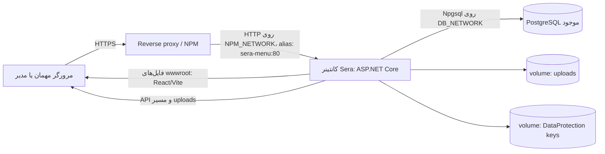
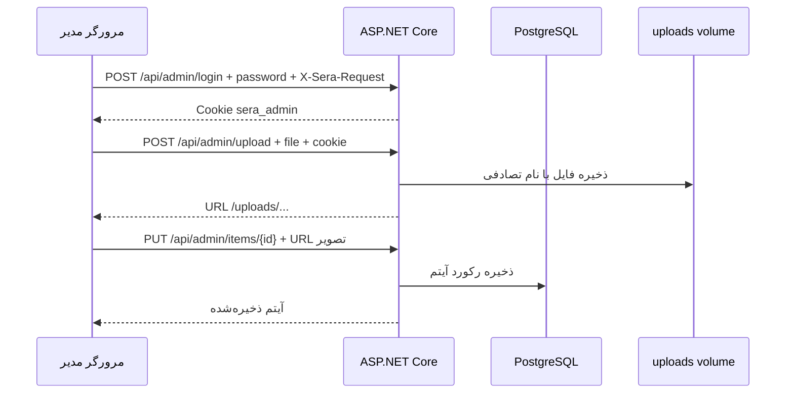

# معماری و ساختار پروژه

## هدف و مرز سامانه

Sera Studio یک سامانهٔ منوی دیجیتال چندمکانه است: هر مکان نام، تصویر، قالب، وضعیت انتشار و مجموعه‌ای از آیتم‌ها دارد. بازدیدکننده مجموعه و منوهای منتشرشده را می‌بیند؛ مدیر با یک پنل، مکان و آیتم‌ها را ویرایش می‌کند. بک‌اند، فایل‌های فرانت‌اند را نیز سرو می‌کند تا مرورگر برای صفحه، API و تصاویر آپلودی از یک مبدأ استفاده کند.

پیاده‌سازی فعلی **تک‌مستاجری در سطح مدیریت** است: یک رمز ادمین به کل مکان‌های داخل همان دیتابیس دسترسی دارد. جداسازی دسترسی هر رستوران، حساب‌های کاربری متعدد، سفارش و پرداخت پیاده‌سازی نشده‌اند.

## نمودار اجزا

در Compose توسعه، پورت میزبان `3000` (یا `SERA_PORT`) به پورت 80 کانتینر وصل می‌شود و اتصال به `NPM_NETWORK` لازم نیست. در Compose تولیدی پورت میزبان منتشر نمی‌شود؛ reverse proxy از شبکهٔ مشترک به `sera-menu:80` می‌رسد. هر دو حالت به PostgreSQL **از پیش موجود** وصل می‌شوند.

## جریان یک درخواست

1. مرورگر URL صفحه مانند `/menu/forno` را درخواست می‌کند. ASP.NET فایل `wwwroot/index.html` را برای مسیرهای SPA برمی‌گرداند.
2. React مسیر را در `useRoute` می‌خواند و `ExperiencePage` یا `AdminPage` را نمایش می‌دهد.
3. کلاینت با `fetch` و مسیرهای نسبی `/api/...` از همان مبدأ داده می‌گیرد. برای منوی عمومی `GET /api/menu/{venueId}` و برای پیش‌نمایش خصوصی `GET /api/admin/menu/{venueId}` استفاده می‌شود.
4. endpoint با `MenuStore` از طریق `NpgsqlDataSource` به PostgreSQL وصل می‌شود. SQL در `MenuStore.cs` به‌صورت مستقیم و پارامتری نوشته شده است؛ ORM وجود ندارد.
5. عکس‌های همراه مخزن از `/images/...` در `wwwroot` می‌آیند. عکس‌های آپلودی از `/uploads/{file}` و volume برنامه خوانده می‌شوند.

## فرایند شروع برنامه

`Program.cs` ابتدا اتصال دیتابیس را می‌سازد. اگر `DATABASE_URL` تنظیم شده باشد بر متغیرهای جداگانهٔ `DB_*` اولویت دارد؛ در غیر این صورت با `NpgsqlConnectionStringBuilder` از `DB_HOST`، `DB_PORT`، `DB_NAME`، `DB_USER` و `DB_PASSWORD` استفاده می‌شود. سپس سرویس‌های احراز هویت، محدودکنندهٔ ورود و routeها ثبت می‌شوند. پیش از `app.Run()`، متد `MenuStore.Initialize()` فایل `schema.sql` را اجرا می‌کند و در صورت خالی بودن جدول `venues`، دادهٔ `seed.json` را وارد می‌کند. بنابراین خطای اتصال یا دسترسی دیتابیس می‌تواند جلوی شروع کانتینر را بگیرد.

`/health` پس از شروع برنامه، `{"status":"ok"}` برمی‌گرداند. این endpoint در هر درخواست یک پرس‌وجوی تازه به دیتابیس نمی‌فرستد؛ سلامت لحظه‌ای دیتابیس را جداگانه تضمین نمی‌کند.

## ساخت ایمیج

`Dockerfile` سه مرحله دارد:

1. `node:22-alpine` وابستگی‌های npm را با `npm ci` نصب و `npm run build` را اجرا می‌کند.
2. `mcr.microsoft.com/dotnet/sdk:10.0` پروژهٔ `server/Sera.Api.csproj` را restore و publish می‌کند. منبع پیش‌فرض NuGet در `ARG NUGET_SOURCE` تعریف شده و قابل تغییر هنگام build است.
3. `mcr.microsoft.com/dotnet/aspnet:10.0` خروجی API، `wwwroot`، `schema.sql` و `seed.json` را در `/app` قرار می‌دهد. Kestrel روی پورت 80 گوش می‌دهد و Docker health check مسیر `/health` را صدا می‌زند.

ایمیج منتشرشده Nginx ندارد. اگر در لاگ کانتینری خطای `upstream "api"` از Nginx دیده می‌شود، آن کانتینر از استقرار قدیمی است.

## ساختار مخزن

| مسیر                                   | مسئولیت                                                         |
| -------------------------------------- | --------------------------------------------------------------- |
| `server/Program.cs`                    | پیکربندی برنامه، middleware، همهٔ endpointها و اعتبارسنجی ورودی |
| `server/Models.cs`                     | recordهای قرارداد داده و تنظیمات JSON                           |
| `server/MenuStore.cs`                  | دسترسی به داده، شروع schema، seed و نگاشت رکوردها               |
| `server/schema.sql`                    | تعریف دو جدول، قیدها و index                                    |
| `server/seed.json`                     | پنج مکان و آیتم‌های نمونه                                       |
| `server/generate_seed.py`              | تولید دوبارهٔ `seed.json`                                       |
| `src/main.tsx`, `src/App.tsx`          | ورود React و انتخاب صفحه بر اساس مسیر                           |
| `src/hooks/use-route.tsx`              | مسیریابی سبک مبتنی بر History API                               |
| `src/lib/api.ts`                       | کلاینت HTTP یکپارچه و مدیریت خطا                                |
| `src/types/platform.ts`                | نوع‌های TypeScript متناظر با JSON بک‌اند                        |
| `src/pages/experience-page.tsx`        | مجموعه، منوی عمومی و صفحهٔ آیتم                                 |
| `src/pages/admin-page.tsx`             | ورود، ویرایش مکان، آیتم و آپلود                                 |
| `src/styles.css`, `src/platform.css`   | پایهٔ ظاهری، قالب‌ها و واکنش‌گرایی                              |
| `public/images/`                       | تصاویر WebP همراه نسخهٔ برنامه                                  |
| `Dockerfile`                           | ایمیج یکپارچهٔ انتشار                                           |
| `docker-compose.yml`                   | ساخت محلی ایمیج و اتصال به شبکهٔ دیتابیس                        |
| `docker-compose.prod.yml`              | دریافت ایمیج GHCR و اتصال به دیتابیس و پروکسی                   |
| `.github/workflows/docker-publish.yml` | ساخت و انتشار خودکار ایمیج                                      |

## تصمیم‌های فنی و پیامدها

- **یک مبدأ برای UI و API:** درخواست‌های کلاینت مسیر نسبی دارند؛ تنظیم CORS برای دامنهٔ جداگانه در این معماری لازم نیست. در توسعه، Vite مسیرهای `/api` و `/uploads` را به `localhost:5000` پروکسی می‌کند.
- **قالب داده‌محور:** مقدار `venue.template` یکی از پنج کلید ثابت است و کلاس CSS متناظر `theme-*` را فعال می‌کند. محتوای منو از قالب جداست.
- **PostgreSQL خارجی:** سامانه دیتابیس جدیدی ایجاد نمی‌کند. فقط جدول‌ها و index لازم را در دیتابیس معرفی‌شده ایجاد می‌کند.
- **تصاویر دو منبع دارند:** تصاویر نسخه‌بندی‌شده با هر ایمیج منتشر می‌شوند، ولی آپلودهای مدیر مستقل از ایمیج و نیازمند volume پایدارند.
- **SQL مستقیم:** رفتار خواندن/نوشتن در `MenuStore` روشن است، اما migration نسخه‌دار برای تغییرهای بعدی schema وجود ندارد؛ تغییر ستون‌ها باید با برنامهٔ migration جداگانه انجام شود.
