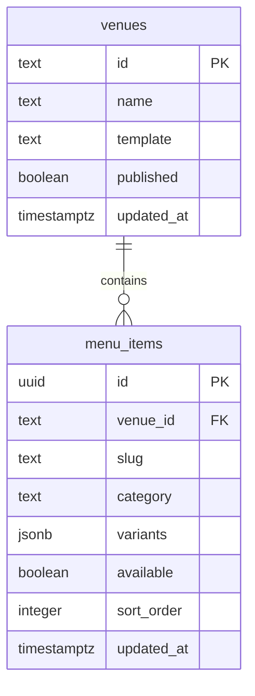

# مدل داده، seed و فایل‌ها

## دیتابیس مورد استفاده

Sera به PostgreSQL موجود وصل می‌شود. هیچ‌یک از فایل‌های Compose، سرویس `postgres` یا volume دادهٔ دیتابیس ایجاد نمی‌کنند. اتصال از `DATABASE_URL` یا متغیرهای `DB_*` ساخته می‌شود و `MenuStore.Initialize()` هنگام شروع، دستورهای [`schema.sql`](../server/schema.sql) را در **همان دیتابیس معرفی‌شده** اجرا می‌کند. کاربر دیتابیس باید اجازهٔ ساخت جدول و index را در schema هدف داشته باشد. برنامه مدیریت ایجاد دیتابیس، ساخت کاربر و تنظیم شبکهٔ PostgreSQL را انجام نمی‌دهد.

## رابطه‌ها

### `venues`

| ستون          | نوع / قید                      | کاربرد                                                         |
| ------------- | ------------------------------ | -------------------------------------------------------------- |
| `id`          | `text`, کلید اصلی              | شناسه و URL مکان؛ در API به‌صورت `id`                          |
| `name`        | `text NOT NULL`                | نام نمایشی                                                     |
| `tagline`     | `text`, پیش‌فرض خالی           | متن کوتاه معرفی                                                |
| `description` | `text`, پیش‌فرض خالی           | توضیح مکان                                                     |
| `location`    | `text`, پیش‌فرض خالی           | نشانی/موقعیت نمایشی                                            |
| `hours`       | `text`, پیش‌فرض خالی           | ساعت کاری نمایشی                                               |
| `currency`    | `text`, پیش‌فرض `EUR`          | کد ارز برای نمایش قیمت                                         |
| `template`    | `text NOT NULL` + `CHECK`      | یکی از `pizzeria`, `traditional`, `fastfood`, `cafe`, `gelato` |
| `hero_image`  | `text`, پیش‌فرض خالی           | URL تصویر اصلی                                                 |
| `published`   | `boolean`, پیش‌فرض `true`      | دسترسی عمومی به مکان و حضور در مجموعه                          |
| `updated_at`  | `timestamptz`, پیش‌فرض `now()` | زمان آخرین ذخیره توسط `SaveVenue`                              |

API نوشتن مکان، `id`، `name` و `template` را لازم می‌داند و محدودیت طول و الگو را جداگانه بررسی می‌کند. دیتابیس همهٔ این محدودیت‌های برنامه را تکرار نمی‌کند؛ اگر داده مستقیم با SQL وارد شود، مسئولیت سازگاری با API بر عهدهٔ واردکننده است.

### `menu_items`

| ستون                               | نوع / قید                                                  | کاربرد                                              |
| ---------------------------------- | ---------------------------------------------------------- | --------------------------------------------------- |
| `id`                               | `uuid`, کلید اصلی؛ پیش‌فرض `gen_random_uuid()`             | شناسهٔ پایدار آیتم                                  |
| `venue_id`                         | `text NOT NULL`, FK به `venues(id)` با `ON DELETE CASCADE` | مالک آیتم                                           |
| `slug`                             | `text NOT NULL`                                            | بخش URL صفحهٔ آیتم                                  |
| `category`                         | `text NOT NULL`                                            | دسته‌بندی فیلتر منو                                 |
| `name`                             | `text NOT NULL`                                            | نام آیتم                                            |
| `subtitle`, `description`, `image` | `text`, پیش‌فرض خالی                                       | متن‌ها و URL تصویر                                  |
| `ingredients`, `allergens`, `tags` | `jsonb`, پیش‌فرض `[]`                                      | آرایه‌های رشته                                      |
| `variants`                         | `jsonb`, پیش‌فرض `[]`                                      | آرایهٔ `{label, price}`؛ API دست‌کم یک عضو می‌خواهد |
| `featured`                         | `boolean`, پیش‌فرض `false`                                 | تأکید بصری کارت                                     |
| `available`                        | `boolean`, پیش‌فرض `true`                                  | نمایش وضعیت موجودی                                  |
| `sort_order`                       | `integer`, پیش‌فرض `0`                                     | ترتیب نمایش                                         |
| `updated_at`                       | `timestamptz`, پیش‌فرض `now()`                             | زمان آخرین ذخیره توسط `SaveItem`                    |

قید `UNIQUE(venue_id, slug)` تکرار URL یک آیتم را داخل یک مکان منع می‌کند. index `menu_items_venue_order_idx` روی `(venue_id, sort_order)` برای خواندن منو وجود دارد. `GetItems` آیتم‌ها را با `ORDER BY sort_order, name` می‌خواند. حذف مکان از راه SQL، آیتم‌هایش را با FK cascade حذف می‌کند؛ endpoint حذف مکان در API فعلی وجود ندارد.

## رفتار خواندن و نوشتن

`MenuStore` از `NpgsqlDataSource` و SQL پارامتری استفاده می‌کند. `SaveVenue` و `SaveItem` هر دو `INSERT ... ON CONFLICT ... UPDATE` هستند. فیلد `updated_at` هنگام update با `now()` عوض می‌شود. آرایه‌ها و variantها پیش از ذخیره به JSON سریال و به ستون `jsonb` ارسال می‌شوند. هنگام خواندن، `ReadVenue` و `ReadItem` داده را به recordهای API نگاشت می‌کنند.

ردیف‌های `venues` و `menu_items` به‌صورت جداگانه خوانده می‌شوند؛ `MenuResponse` شیء `venue` و آرایهٔ `items` را کنار هم قرار می‌دهد. مکان منتشرنشده در endpoint عمومی `GET /api/menu/{id}` قابل دریافت نیست، اما endpoint ادمین آن را برای پیش‌نمایش برمی‌گرداند.

## دادهٔ اولیه

فایل [`seed.json`](../server/seed.json) توسط [`generate_seed.py`](../server/generate_seed.py) تولید شده است. در شروع برنامه، بعد از اجرای schema، `SELECT count(*) FROM venues` انجام می‌شود:

- اگر شمار مکان‌ها **صفر** باشد، پنج مکان و ۲۴ آیتم وارد می‌شوند. شناسهٔ هر آیتم هنگام import به UUID جدید تبدیل می‌شود.
- اگر دست‌کم یک مکان موجود باشد، هیچ‌کدام از رکوردهای seed دوباره وارد یا به‌روزرسانی نمی‌شوند.

| ID مکان  | قالب          | تعداد آیتم نمونه | توضیح                   |
| -------- | ------------- | ---------------: | ----------------------- |
| `forno`  | `pizzeria`    |               ۱۲ | منوی پیتزای ایتالیایی   |
| `narenj` | `traditional` |                ۳ | غذای سنتی ایرانی        |
| `stack`  | `fastfood`    |                ۳ | برگر و مخلفات           |
| `morrow` | `cafe`        |                ۳ | قهوه و شیرینی           |
| `scoop`  | `gelato`      |                ۳ | بستنی و نوشیدنی میوه‌ای |

قیمت‌ها، مواد و آلرژن‌های seed صرفاً دادهٔ نمایشی‌اند و باید پیش از استفادهٔ تجاری توسط کسب‌وکار بررسی شوند. متن‌ها و ارز اولیهٔ نمونه‌ها انگلیسی/`EUR` هستند؛ پنل امکان تغییر دادهٔ مکان و آیتم را می‌دهد. اجرای `python server/generate_seed.py` فایل JSON داخل مخزن را بازسازی می‌کند، اما دیتابیس دارای مکان را تغییر نمی‌دهد. برای دادهٔ عملیاتی از پنل یا یک فرایند import/migration کنترل‌شده استفاده کنید.

**محدودیت seed:** شرط فقط «خالی بودن جدول مکان‌ها» است. اگر import اولیه پس از وارد شدن یک مکان و پیش از تکمیل آیتم‌ها قطع شود، شروع بعدی seed را از سر نمی‌گیرد. برای محیط عملیاتی، قبل از پاک‌سازی یا وارد کردن دوبارهٔ داده، وضعیت دیتابیس را بررسی و از آن پشتیبان تهیه کنید.

## تغییر schema

`CREATE TABLE IF NOT EXISTS` و `CREATE INDEX IF NOT EXISTS` برای دیتابیس تازه مناسب‌اند. این فایل migration نسخه‌دار نیست و ستون‌های جدول موجود را با `ALTER TABLE` تغییر نمی‌دهد. تغییر نوع/ستون/قید در آینده باید با migration مستقل، نسخه‌بندی‌شده و قابل بازگشت انجام شود. اجرای نسخهٔ جدید ایمیج به‌تنهایی schema موجود را ارتقا نمی‌دهد.

## تصاویر و نگه‌داری فایل

| مسیر URL          | محل نگه‌داری                                                       | عمر داده                    |
| ----------------- | ------------------------------------------------------------------ | --------------------------- |
| `/images/*.webp`  | `public/images/` در مخزن؛ در build به `wwwroot/images/` کپی می‌شود | همراه نسخهٔ ایمیج           |
| `/uploads/{name}` | `/app/uploads` در کانتینر                                          | باید روی volume پایدار باشد |

آپلود از پنل URL جدید را به فیلد `heroImage` یا `image` می‌دهد؛ خود endpoint فقط فایل را ذخیره می‌کند و رکورد دیتابیس را تغییر نمی‌دهد. پس از آپلود، باید فرم مکان/آیتم را ذخیره کرد. حذف آیتم یا تعویض تصویر، فایل قدیمی را پاک نمی‌کند؛ فرایند پاک‌سازی خودکار فایل‌های بی‌استفاده وجود ندارد. تصاویر نسخه‌بندی‌شده با ویرایش یا حذف فایل از مخزن و build جدید عوض می‌شوند، اما تصاویر آپلودی مستقل از ایمیج‌اند.

## پشتیبان‌گیری و بازیابی

برای بازیابی کامل، **دیتابیس و volume آپلودها را با هم** پشتیبان بگیرید؛ رکوردهای دیتابیس URL تصاویر آپلودی را نگه می‌دارند. volume کلیدهای Data Protection نیز برای معتبر ماندن نشست‌های فعلی پس از جایگزینی کانتینر مهم است. در Compose نام volumeها `uploads` و `protection_keys` است، ولی Docker Compose معمولاً پیشوند نام پروژه را به نام volume واقعی اضافه می‌کند؛ با `docker volume ls` یا `docker compose ... config` نام نهایی را بررسی کنید.

یک الگوی معمول برای دیتابیس، اجرای `pg_dump` توسط مدیر PostgreSQL موجود است. قبل از بازیابی، نسخهٔ schema و حجم عکس‌ها را بررسی کنید؛ اجرای بی‌برنامهٔ `seed.json` روی دیتابیس تولیدی ممکن است داده‌های واقعی را با دادهٔ نمایشی مخلوط کند.
