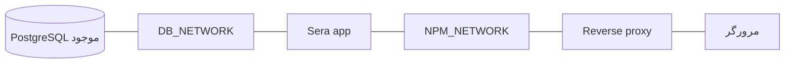

# راه‌اندازی و اتصال سرویس‌ها

## پیش‌نیازها

- Docker Engine و Docker Compose برای اجرای کانتینری.
- یک PostgreSQL موجود با دیتابیس و کاربر مختص Sera. کاربر باید در اولین راه‌اندازی اجازهٔ ساخت جدول و index در schema هدف را داشته باشد.
- شبکهٔ Docker خارجی که کانتینر PostgreSQL روی آن در دسترس است؛ نام آن را در `DB_NETWORK` می‌گذارید.
- برای Compose تولیدی، شبکهٔ خارجی reverse proxy (برای مثال Nginx Proxy Manager) با نام `NPM_NETWORK`.
- برای توسعهٔ بدون Docker: Node.js `>=22.13`، npm، .NET SDK 10 و دسترسی به PostgreSQL.

## متغیرهای محیطی

از [`.env.example`](../.env.example) یک فایل `.env` بسازید. `.env` در Git نادیده گرفته می‌شود؛ رمز واقعی را در مخزن ثبت نکنید.

| متغیر                                 | لازم در Compose                               | کاربرد                                                                                    |
| ------------------------------------- | --------------------------------------------- | ----------------------------------------------------------------------------------------- |
| `DB_HOST`                             | بله                                           | نام کانتینر یا alias PostgreSQL در شبکهٔ `DB_NETWORK`؛ `localhost` داخل Sera خود Sera است |
| `DB_PORT`                             | خیر، پیش‌فرض `5432`                           | پورت TCP PostgreSQL                                                                       |
| `DB_NAME`                             | بله                                           | نام دیتابیس **موجود** Sera                                                                |
| `DB_USER`                             | بله                                           | کاربر دیتابیس **موجود**                                                                   |
| `DB_PASSWORD`                         | بله                                           | رمز همان کاربر                                                                            |
| `DB_NETWORK`                          | بله                                           | نام دقیق شبکهٔ Docker خارجی دیتابیس                                                       |
| `NPM_NETWORK`                         | فقط Compose تولیدی                            | نام دقیق شبکهٔ Docker خارجی پروکسی                                                        |
| `SERA_ADMIN_PASSWORD`                 | بله                                           | رمز واحد پنل؛ حداقل ۱۲ کاراکتر                                                            |
| `SERA_PORT`                           | فقط Compose ساخت محلی، اختیاری                | پورت میزبان؛ پیش‌فرض `3000`                                                               |
| `DATABASE_URL`                        | جایگزین `DB_*` برای اجرای مستقیم برنامه/ایمیج | connection string به قالب Npgsql؛ اگر حاضر باشد اولویت دارد                               |
| `ASPNETCORE_FORWARDEDHEADERS_ENABLED` | در Compose مقدار `true` دارد                  | دریافت پروتکل اصلی درخواست هنگام استقرار پشت پروکسی HTTPS                                 |

کد، مقادیر `DB_*` را با `NpgsqlConnectionStringBuilder` ترکیب می‌کند؛ رمزهای دارای کاراکتر ویژه مانند `;` نیز به شکل امن در connection string قرار می‌گیرند. `DB_PORT` باید عددی از ۱ تا ۶۵۵۳۵ باشد. اگر برنامه مستقیم و بدون Compose اجرا می‌شود، می‌توان به‌جای پنج متغیر اول از `DATABASE_URL` استفاده کرد؛ برای نمونه:

```text
Host=postgres-host;Port=5432;Database=sera_db;Username=sera_user;Password=your-password
```

در هر دو حالت PostgreSQL باید از **داخل کانتینر** قابل دسترسی باشد. `DB_HOST` نام سرویس یا alias دیتابیس روی شبکهٔ مشترک است، نه نامی که فقط روی میزبان resolve می‌شود.

## اتصال شبکه‌ها

`docker-compose.yml` یک سرویس `app` می‌سازد، آن را به شبکهٔ خارجی دیتابیس وصل می‌کند و پورت 80 کانتینر را روی `SERA_PORT` میزبان منتشر می‌کند. `docker-compose.prod.yml` نیز فقط سرویس `app` دارد؛ ایمیج آماده را از GHCR می‌گیرد، به هر دو شبکهٔ `database` و `proxy` می‌پیوندد، alias `sera-menu` می‌گیرد و فقط پورت داخلی 80 را expose می‌کند.



نام شبکه‌های موجود را در سرور با `docker network ls` ببینید و عضویت کانتینر دیتابیس را با `docker network inspect <DB_NETWORK>` بررسی کنید. این پروژه شبکهٔ `database` یا `proxy` را ایجاد نمی‌کند؛ هر دو در Compose تولیدی `external: true` هستند. اگر نام یا دسترسی شبکه نادرست باشد، Compose قبل از شروع برنامه خطا می‌دهد یا برنامه نمی‌تواند دیتابیس را resolve کند.

## اجرای محلی با Docker Compose

1. `.env` را با مقادیر سرور خود پر کنید. `NPM_NETWORK` برای این فایل لازم نیست.
2. از ریشهٔ مخزن اجرا کنید:

```bash
docker compose -f docker-compose.yml config --services
docker compose -f docker-compose.yml up --build -d
docker compose -f docker-compose.yml ps
curl -fsS http://localhost:3000/health
```

خروجی `config --services` باید فقط `app` باشد. صفحهٔ مجموعه روی `http://localhost:3000/` و پنل روی `/admin` است. اگر `SERA_PORT` را تغییر داده‌اید، همان پورت جدید را در URL بگذارید.

## استقرار با ایمیج آماده و reverse proxy

1. `.env` را با `DB_*`، `DB_NETWORK`، `NPM_NETWORK` و `SERA_ADMIN_PASSWORD` پر کنید.
2. مطمئن شوید کانتینر دیتابیس روی `DB_NETWORK` و reverse proxy روی `NPM_NETWORK` هستند.
3. اجرا کنید:

```bash
docker compose -f docker-compose.prod.yml config --services
docker compose -f docker-compose.prod.yml pull
docker compose -f docker-compose.prod.yml up -d
docker compose -f docker-compose.prod.yml ps
docker compose -f docker-compose.prod.yml logs --tail=100 app
```

خروجی فهرست سرویس‌ها فقط `app` است. در reverse proxy مقصد را `sera-menu` و پورت را `80` روی شبکهٔ `NPM_NETWORK` قرار دهید. درخواست عمومی را با HTTPS به reverse proxy بفرستید. مسیر health check برابر `/health` است.

اگر پنل استقرار به‌جای Compose یک ایمیج را مستقیم اجرا می‌کند، ایمیج `ghcr.io/cnafateh/seradigitalrestaurantmenu:latest`، پورت داخلی `80`، متغیرهای `DB_*` و `SERA_ADMIN_PASSWORD` را تنظیم کنید و **خود کانتینر** را به شبکهٔ دیتابیس وصل کنید. در صورت استفاده از reverse proxy کانتینری، اتصال به شبکهٔ پروکسی نیز لازم است. Compose این اتصال‌ها را خودکار انجام می‌دهد؛ اجرای مستقیم ایمیج نه.

## توسعهٔ بدون Docker

برای UI، در ریشهٔ مخزن `npm ci` و سپس `npm run dev` را اجرا کنید. Vite درخواست‌های `/api` و `/uploads` را به `http://localhost:5000` می‌فرستد. برای API، از پوشهٔ `server` برنامه را اجرا کنید تا `schema.sql` و `seed.json` در content root پیدا شوند:

```bash
cd server
dotnet run --urls http://localhost:5000
```

قبل از اجرا، `DATABASE_URL` یا متغیرهای `DB_*` و همچنین `SERA_ADMIN_PASSWORD` را در محیط فرایند قرار دهید. نام `DB_HOST` در اجرای روی میزبان ممکن است با نام شبکهٔ Docker فرق کند؛ مثلاً اگر PostgreSQL پورتش را روی میزبان منتشر کرده باشد، آدرس میزبان مناسب است. برای دیدن پورت Vite به خروجی `npm run dev` مراجعه کنید.

## اولین شروع و دادهٔ نمونه

API در startup دستورهای `schema.sql` را اجرا می‌کند. اگر شمار مکان‌ها صفر باشد، پنج مکان و ۲۴ آیتم از `seed.json` اضافه می‌شوند؛ ۱۲ آیتم به پیتزافروشی `forno` تعلق دارند. این کار **دیتابیس جدید نمی‌سازد**. اگر نمی‌خواهید دادهٔ نمونه وارد دیتابیس تازه شود، قبل از اولین شروع برنامه دادهٔ مورد نظر خود را آماده کنید یا فرایند seed را مطابق نیاز تغییر دهید. جزئیات در [مدل داده](data.md) آمده است.
